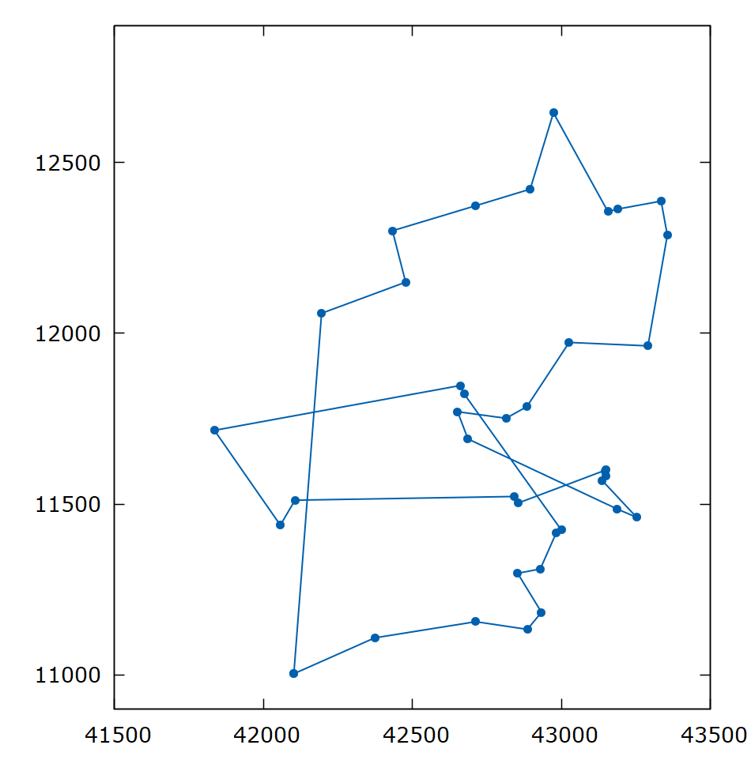

# simulated-annealing-TSP
Simulated Annealing for TSP.

### Dependencies
* Rust v1.5
* Cargo v.15
* Gnuplot v5.4

### Input 

A file with the `(x,y)` coordinates of every city with this format.

```
#X #Y
1.23 3.45
5.54 6.78
9.78 3.43
```

### Run 

`path_file`: The path of file with the coordinates of every city.

```bash
cargo run <path_file>
```

As result there is a file `data.dat` which has the sorted coordinates of the best path found.

Then exect the Gnuplot script to see the output.

```bash
gnuplot load_graph.gp
```

<div class="col-md-offset">
  
</div>

### Test

```bash
cargo test
```
